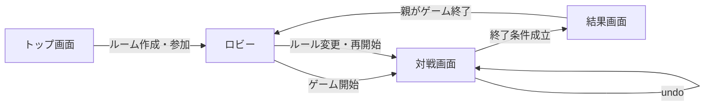

# 3. システム概要

## 3.1 システム構成

システムはフロントエンドとバックエンドに分離する。フロントエンドはVue 3 + Vuetify + Viteで構築し、Cloudflare Pagesにデプロイする。バックエンドはPython 3.14 + FastAPIで構築し、VPS上のアプリケーションコンテナでホストする。nginxはVPSホストへインストールし、SQLiteはVPSホスト上のデータファイルをアプリケーションから利用する。通信はHTTP POST/PUT + SSE（Server-Sent Events）で行う。バックエンドのパッケージ管理にはuvを使用する。

```text
Cloudflare Pages (フロントエンド)
├── Vue 3 + Vuetify + Vite
├── ブラウザ localStorage（名前付きプリセット保存）
└── EventSource API（SSE接続）
         ↑↓ HTTPS
VPS（ホスト）
├── nginx（リバースプロキシ・SSL終端）
├── Python 3.14 + FastAPI（アプリケーションコンテナ、API・SSE）
└── SQLiteファイル（ホスト上のゲーム状態永続化）
```

### 3.1.1 フロントエンドの責務

- トップ画面、ロビー、対戦画面、結果画面の表示
- 名前付き設定プリセットの`localStorage`への明示保存・読み込み
- SSE接続の確立・自動再接続管理
- サーバーから配信されるゲーム状態の表示
- 親および手番プレイヤーのHTTP送信
- プレイヤー名、単語、エラーメッセージなどの安全な表示（HTMLエスケープ）

### 3.1.2 バックエンドの責務

- ルーム管理（作成、参加、パスワード認証）
- ゲームエンジン（カード生成、しりとり判定、手番管理、ビンゴ計算）
- SSEストリームによる状態ブロードキャスト
- SQLiteへのゲーム状態永続化
- undo履歴の管理

## 3.2 画面状態

画面全体は、次の4状態を持つ。

| 状態 | 内容 |
| --- | --- |
| `top` | ルーム作成またはルーム参加を選択するトップ画面 |
| `lobby` | 参加者とルールを設定し、ゲーム開始を待つロビー |
| `playing` | 対戦画面（現在の手番プレイヤーが入力操作可能） |
| `result` | 終了したゲームの結果を表示し、親のロビー復帰操作を待つ結果画面 |



## 3.3 フロントエンドの責務

### 設定管理

- 初期値を生成する。
- `localStorage`から利用者が保存した名前付きプリセットを読み込む。
- 入力された設定を画面状態へ反映する。
- 利用者がプリセット保存を明示的に実行したときだけ、名前付きプリセットを保存する。

### ゲーム初期化

- フロントエンドは設定をサーバーへ送信し、サーバーがフリーマス文字、プレイヤー順、カードを生成する。
- サーバーから返却されたルームIDとURLを表示し、参加者に共有する。

### ゲーム進行

- SSEで配信されるゲーム状態を受信し、画面を更新する。
- 現在の手番プレイヤーは入力欄から単語を送信し、サーバーで判定・同期を行う。
- ゲームルール上の無効入力時は、サーバーが設定に応じた処理を適用し、更新後の状態と処理結果を配信する。
- タイマーはサーバー配信のremainingTimeMsを元に表示する。フロント側の独自タイマーはゲーム状態の信頼源としない。

### 描画

- フロントエンドの画面、状態表示、入力処理、画面遷移はVue 3のコンポーネントとテンプレートで実装する。
- プレイヤー名、単語、エラーメッセージなどの入力値をHTMLとして解釈しない。
- 利用者入力は通常のテキストバインディングで表示し、`v-html`は使用しない。

## 3.4 設定プリセットの保存

設定プリセットの保存先はブラウザの`localStorage`とする。再接続Cookieはプレイヤー識別のために使用し、設定プリセットとは別に管理する。

| 項目 | 値 |
| --- | --- |
| キー | `shiritori-bingo:presets:v1` |
| 形式 | JSON配列 |
| 保存対象 | プリセットID、プリセット名、カード設定、終了条件、目標値、制限時間、無効入力の扱い、作成日時、更新日時 |
| 保存タイミング | 利用者がプリセット保存を明示的に実行したとき |
| ゲーム状態の管理場所 | サーバーのSQLite |

保存データが壊れている場合は該当プリセットを読み込まず、初期設定を表示する。`localStorage`が利用できない場合でもゲームは開始できるが、プリセットを保存できないことを画面に通知する。

## 3.5 乱数

プレイヤー順、フリーマス文字、カード文字の生成はバックエンドで行う。バックエンドではPythonの`secrets`モジュールなど、暗号学的に安全な乱数を使用する。同じカード内ではフリーマスを含めて文字を重複させず、別のカード間では同じ文字の重複を許可する。

## 3.6 実行環境

- PCを対象とする。
- Androidスマートフォン・タブレットを対象とする。
- iOS/iPadOSスマートフォン・タブレットを対象とする。
- フロントエンドはCloudflare Pages経由でHTTPS配信される。
- バックエンドはPython 3.14 + FastAPIのアプリケーションコンテナとしてVPS上でホストされる。nginxはVPSホストへインストールする。
- フロントからバックエンドへはHTTPS経由で通信する。
- フォントには M PLUS 1 を使用する。外部フォント配信サービス、画像、外部CDNは使用せず、フォントファイル、Vue、Vuetify、その他の依存関係はビルド時にバンドル（セルフホスト）する。
- 画面サイズに応じてレスポンシブレイアウトを適用する。PC・タブレットでは横並び、スマートフォンでは縦積みのレイアウトを基本とする。
