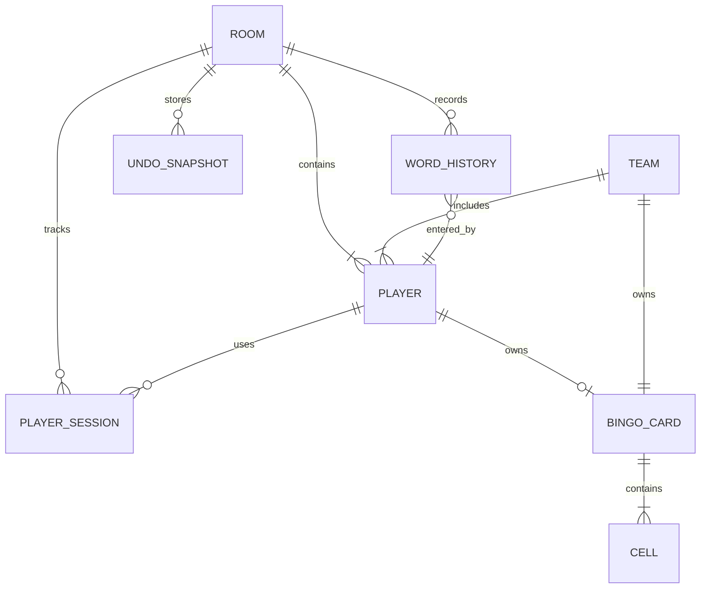

# 9. データモデル・状態遷移

## 9.1 設定データ

設定データはルーム作成時にサーバーへ送信し、サーバー側のSQLiteに`Room.settings`として保持する。ブラウザの`localStorage`には、利用者が明示的に保存した名前付きプリセットを保存する。参加人数と参加者名は設定プリセットに含めず、ロビー参加時にサーバーへ登録する。

```text
Preset
├── id: string
├── name: string
├── settings: Settings
├── createdAt: number
└── updatedAt: number
```

```text
Settings
├── cardSize: number
├── mode: "individual" | "team"
├── teamCount: number
├── cardOptions
│   ├── yoon: boolean
│   ├── sokuon: boolean
│   ├── prolonged: boolean
│   ├── smallA: boolean
│   ├── dakuten: boolean
│   └── handakuten: boolean
├── endCondition: "turns" | "bingos"
├── targetTurns: number
├── targetBingos: number
├── timeLimitSeconds: number
├── extraTimeSeconds: number
├── forceSkipOnTimeout: boolean
├── invalidAction: "skip" | "disqualify"
├── inputWordCheck: boolean
├── minWordLength: number | null
└── maxWordLength: number | null
```

## 9.1.1 DBスキーマ（SQLite）

バックエンドはSQLiteでゲーム状態を永続化する。主なテーブルは以下の通り。

### roomsテーブル

| カラム | 型 | 説明 |
| --- | --- | --- |
| id | TEXT PRIMARY KEY | ルームID（URL-safeなランダム文字列） |
| password_hash | TEXT | パスワードのbcryptハッシュ（nullable） |
| settings_json | TEXT | SettingsのJSON文字列 |
| phase | TEXT | "setup" | "playing" | "result" |
| free_char | TEXT | フリーマス文字 |
| current_player_id | TEXT | 個人戦の現在プレイヤーID。チーム戦ではNULL |
| current_team_id | TEXT | チーム戦の現在チームID。個人戦ではNULL |
| required_start_char | TEXT | 現在の開始文字 |
| round | INTEGER | 現在のターン数 |
| order_index | INTEGER | 手番順のインデックス |
| remaining_time_ms | INTEGER | 残り時間（ミリ秒） |
| current_turn_time_limit_ms | INTEGER | 現在の手番の制限時間（ミリ秒） |
| turn_started_at | INTEGER | 手番開始時刻（Unix timestamp ms） |
| result_json | TEXT | 結果画面に必要な確定済みResultSnapshotを含むJSON文字列（nullable） |
| created_at | INTEGER | ルーム作成時刻 |
| updated_at | INTEGER | 最終更新時刻 |
| host_player_id | TEXT | 現在の親プレイヤーID |
| round_roster_json | TEXT | 現在のターンの対象ID配列。個人戦はプレイヤーID、チーム戦はチームID |

### playersテーブル

| カラム | 型 | 説明 |
| --- | --- | --- |
| id | TEXT PRIMARY KEY | プレイヤーID |
| room_id | TEXT FK | 所属ルームID |
| name | TEXT | プレイヤー名 |
| status | TEXT | 個人戦では"active" | "disqualified"。チーム戦ではNULL |
| card_json | TEXT | 個人戦ではBingoCardのJSON文字列、チーム戦ではNULL |
| bingo_line_ids_json | TEXT | 個人戦では成立ビンゴ列IDのJSON配列、チーム戦ではNULL |
| opened_cell_count | INTEGER | 個人戦では開放済みマス数、チーム戦ではNULL |
| sort_order | INTEGER | 手番順 |
| team_id | TEXT FK | 所属チームID（個人戦ではnullable） |
| connection_status | TEXT | "connected" | "disconnected" |
| disconnected_at | INTEGER | 切断検知時刻（nullable） |
| is_cpu | BOOLEAN | CPUプレイヤーフラグ（デフォルト: 0/FALSE） |

### teamsテーブル

| カラム | 型 | 説明 |
| --- | --- | --- |
| id | TEXT PRIMARY KEY | チームID |
| room_id | TEXT FK | 所属ルームID |
| sort_order | INTEGER | チーム手番順 |
| status | TEXT | "active" | "disqualified" |
| card_json | TEXT | チームで共有するBingoCardのJSON文字列 |
| bingo_line_ids_json | TEXT | 成立ビンゴ列IDのJSON配列 |
| opened_cell_count | INTEGER | 開放済みマス数 |

### player_sessionsテーブル

| カラム | 型 | 説明 |
| --- | --- | --- |
| id | TEXT PRIMARY KEY | 接続セッションID |
| room_id | TEXT FK | 所属ルームID |
| player_id | TEXT FK | 対応するプレイヤーID |
| token_hash | TEXT | 再接続Cookieのハッシュ |
| active_connections | INTEGER | 同じCookieによる接続数 |
| last_seen_at | INTEGER | 最終接続確認時刻 |
| disconnected_at | INTEGER | すべての接続が切断された時刻（nullable） |

### word_historyテーブル

| カラム | 型 | 説明 |
| --- | --- | --- |
| id | INTEGER PK AUTOINCREMENT | 履歴ID |
| room_id | TEXT FK | 所属ルームID |
| player_id | TEXT | 入力プレイヤーID |
| word | TEXT | 入力単語 |
| round | INTEGER | ターン数 |
| sequence | INTEGER | 手番内順序 |
| opened_chars_json | TEXT | 開放文字のJSON配列 |
| created_at | INTEGER | 登録時刻 |

### undo_snapshotsテーブル

| カラム | 型 | 説明 |
| --- | --- | --- |
| id | INTEGER PK AUTOINCREMENT | スナップショットID |
| room_id | TEXT FK | 所属ルームID |
| snapshot_json | TEXT | GameSnapshotのJSON文字列 |
| restored_turn_time_limit_ms | INTEGER | 復元時の制限時間 |
| created_at | INTEGER | 登録時刻 |

undo_snapshotsは、操作のたびに追加し、undo時に最新1件を取り出して復元する。ゲーム終了時や一定期間経過後に古いスナップショットを削除してもよい。

## 9.2 プレイヤーデータ

```text
Player
├── id: string
├── name: string
├── teamId: string | null
├── status: "active" | "disqualified" | null（チーム戦ではNULL）
├── connectionStatus: "connected" | "disconnected"
├── disconnectedAt: number | null
├── card: BingoCard | null（チーム戦ではNULL）
├── bingoLineIds: string[] | null（チーム戦ではNULL）
├── openedCellCount: number | null（チーム戦ではNULL）
└── isCpu: boolean
```

チーム戦では、プレイヤーは名前、チーム所属、接続状態、入力者識別の単位としてのみ管理し、カード、ビンゴ数、開放マス数、失格状態は持たない。チームのカード、ビンゴ数、開放マス数、失格状態は`Team`で一元管理する。個人戦では`teamId`をnullとし、プレイヤーごとにカードを保持する。

```text
Team
├── id: string
├── memberPlayerIds: string[]
├── status: "active" | "disqualified"
├── card: BingoCard
├── bingoLineIds: string[]
└── openedCellCount: number
```

`id`はロビー参加時にサーバーが生成する一意な識別子であり、名前を識別子として使用しない。名前が同じ場合でも別プレイヤーとして扱う。再接続Cookieはこの`id`に紐付け、同じCookieからの再接続では同じプレイヤーを復元する。

## 9.3 カードデータ

```text
BingoCard
├── size: number
├── cells: Cell[size * size]
└── freeChar: string

Cell
├── index: number
├── row: number
├── column: number
├── char: string
├── isFree: boolean
└── isOpen: boolean
```

中央マスの行・列は`floor(size / 2)`、インデックスは`floor(size / 2) * size + floor(size / 2)`とする。中央マスは`isFree=true`、`isOpen=true`で生成し、中央以外のマスは`isFree=false`、`isOpen=false`で生成する。

## 9.4 ゲーム状態

```text
GameState
├── phase: "setup" | "playing" | "result"
├── settings: Settings
├── hostPlayerId: string | null
├── freeChar: string
├── players: Player[]
├── teams: Team[]
├── playOrder: string[]
├── round: number
├── roundRoster: string[]
├── orderIndex: number
├── currentPlayerId: string | null（個人戦のみ）
├── currentTeamId: string | null（チーム戦のみ）
├── requiredStartChar: string
├── usedWords: string[]
├── wordHistory: WordEntry[]
├── remainingTimeMs: number
├── currentTurnTimeLimitMs: number
├── currentTurnInputPlayerId: string | null
├── turnStartedAt: number | null
├── assistSuggestions: string[]
├── result: GameResult | null
└── undoHistory: UndoSnapshot[]
```

`GameState`はサーバーのSQLiteへ永続化し、SSEで認証済みのクライアントへ配信する。ブラウザの`localStorage`は設定プリセットの管理に使用する。

```text
GameResult
├── reason: "turns" | "bingos" | "all_disqualified"
├── endRound: number
├── achieverPlayerIds: string[]
├── achieverTeamIds: string[]
├── rankings: Ranking[]
└── snapshot: ResultSnapshot

ResultSnapshot
├── players: PlayerResult[]
├── teams: TeamResult[]
├── wordHistory: WordEntry[]
├── freeChar: string
└── settings: Settings

PlayerResult
├── playerId: string
├── name: string
├── teamId: string | null
├── status: "active" | "disqualified" | null
├── card: BingoCard | null
├── bingoLineIds: string[] | null
├── openedCellCount: number | null
└── connectionStatus: "connected" | "disconnected"

TeamResult
├── teamId: string
├── memberPlayerIds: string[]
├── status: "active" | "disqualified"
├── card: BingoCard
├── bingoLineIds: string[]
└── openedCellCount: number
```

```text
Ranking
├── rank: number | null
├── subjectType: "player" | "team"
├── subjectId: string
├── bingoCount: number
├── openedCellCount: number
└── status: "active" | "disqualified"
```

順位（`rank`）は Standard Competition Ranking（1224方式）で計算する。同点の場合は同順位とし、次の順位は同順位の数だけスキップする。失格者の `rank` は `null`（UI上は「失格」）とする。

`phase`が`result`の場合、`GameState`は確定した`GameResult`を含む。結果画面のカード、単語履歴、文字開放状態表は`result.snapshot`から表示する。結果画面で参加者を削除しても、確定済みの結果表示は維持する。

## 9.5 単語履歴

```text
WordEntry
├── word: string
├── playerId: string
├── round: number
├── sequence: number
└── openedChars: string[]
```

`openedChars`は入力単語から重複を除いた文字一覧であり、カードに実際に存在した文字だけに限定しない。結果画面の文字開放状態表は、全カードのセルを走査し、各文字の`isOpen`状態から生成する。

## 9.6 undoスナップショット

```text
UndoSnapshot
├── gameStateBeforeAction: GameSnapshot
└── restoredTurnTimeLimitMs: number
```

`GameSnapshot`は`GameState`から`undoHistory`だけを除いた復元用の状態である。ゲーム状態を変更する直前に、`GameSnapshot`を深く複製して`undoHistory`へ積む。スナップショットの中に別のundo履歴を含めないことで、履歴の再帰的な複製を防ぐ。

undoでは最新のスナップショットを取り出し、復元された手番の制限時間を、その手番の開始時設定へリセットする。`turnStartedAt`もundo実行時刻へ更新する。1ターン目の1人目を復元した場合は、エクストラタイムを含む時間へリセットする。`result`状態ではundoを実行しない。

## 9.7 DB概念ER図

SQLiteのテーブル関係を次の概念ER図で表す。



## 9.8 状態遷移

状態遷移はバックエンドで管理し、更新後はSSEで全クライアントへ配信する。

### setupからplaying

- ロビー作成時にフロントエンドからルール設定を受信する。
- ロビー参加時に参加者名を受信し、プレイヤーIDと再接続セッションを発行してSQLiteへプレイヤーを登録する。
- 参加時および名前変更時に名前が空文字でないことを確認する。名前変更は`setup`状態で、対象プレイヤー自身の再接続Cookieからのみ受け付ける。
- 親がゲーム開始を要求した時点で2人以上の参加を確認する。
- チーム戦ではチーム数が参加者数以下であることを確認し、未所属者をチーム間の人数差が1以内になるようランダム配置する。配置後に所属人数が0人のチームが存在する場合は開始を拒否する。
- SQLiteにカードを含むゲーム状態を生成する。
- 個人戦ではプレイヤーごと、チーム戦ではチームごとにカードを生成する。
- `round=1`、`orderIndex=0`、`requiredStartChar=freeChar`を設定する。
- `phase`を`playing`へ変更する。
- 初期状態をSSEで配信する。

### playing内の有効単語

- undoスナップショットをSQLiteに保存する。
- 単語を履歴と既出集合へ追加する。
- 全カードの文字一致マスを開く。
- チーム戦では、入力者を現在チームのメンバーとして記録し、共有カードのビンゴ列を再計算する。
- ビンゴ列を再計算する。
- 語尾を正規化して次の開始文字を設定する。
- 現在手番を消化し、次の手番または次のターンへ進む。
- 更新後の状態をSSEで配信する。

### playing内の無効入力

- undoスナップショットをSQLiteに保存する。
- ターンスキップまたは失格を適用する。
- 開始文字とカードを変更しない。
- 現在手番を消化し、次の手番または次のターンへ進む。
- 更新後の状態をSSEで配信する。

時間切れ時の強制スキップが有効な場合は、サーバーが手番の制限時間到達を検知し、単語履歴とカードを変更せず現在手番を消化する。処理は通常のターンスキップと同じ状態遷移として記録し、全クライアントへ配信する。

### playingからresult

- 指定ターン数および指定ビンゴ数は、現在ターンの全手番処理後に終了条件を判定する。
- 個人戦で全プレイヤー、チーム戦で全チームが失格になった場合は、ターン終了を待たずに即時で終了条件成立とする。
- 順位を Standard Competition Ranking に従い計算する。
- `ResultSnapshot`へ結果画面に必要なプレイヤー、チーム、カード、単語履歴を確定保存する。
- `GameResult`へ終了理由、終了ターン、達成者、順位、`ResultSnapshot`を保存する。
- 親以外のクライアントからのロビー復帰要求は拒否する。
- プレイヤー名と親の状態は維持し、ロビーで次のゲームのルールを変更できる。
- ロビーでは参加者自身の名前変更を受け付け、更新後のプレイヤー名を全クライアントへSSEで配信する。ゲーム中および結果画面では名前を変更できない。
- ロビー復帰後は2人以上の参加者が揃っていれば、同じルームで新しいゲームを開始できる。

結果状態から対戦状態への遷移は存在しない。結果画面ではundoを受け付けず、親がロビー復帰を要求した場合だけ`setup`へ遷移する。

### 接続切断と再接続

- `setup`または`result`状態ですべての接続が切断されたプレイヤーは、切断検知から30分間、同じ再接続Cookieによる復帰を受け付ける。
- `setup`または`result`状態で30分以内に復帰しなかったプレイヤーは、該当状態の参加者から削除する。結果状態では、`ResultSnapshot`を保持する。
- `playing`状態では切断プレイヤーを削除せず、ゲームが結果状態へ移るまで再接続を受け付ける。切断中のプレイヤーを自動スキップまたは自動失格にしない。
- `playing`状態で切断した現在プレイヤーの手番は、親が手動操作するまで維持する。
- 親のすべての接続が切断された場合は、状態にかかわらず、接続中の参加者のうち参加登録順で先頭の参加者へ即時に親を移譲する。元の親が再接続しても自動的には親へ戻さない。
- 接続中の参加者がいない場合は親を一時的に未設定とし、次に接続した参加者へ親を移譲する。
- 親の移譲結果は、更新後のゲーム状態と通知内容をSSEで全クライアントへ配信する。
- プレイヤーが0人になった場合は、関連するルームと履歴を削除する。
- フェーズや接続の有無にかかわらず、作成または最終更新から24時間が経過したルーム（`playing`状態を含む）は、サーバーにより自動的に強制削除する。
