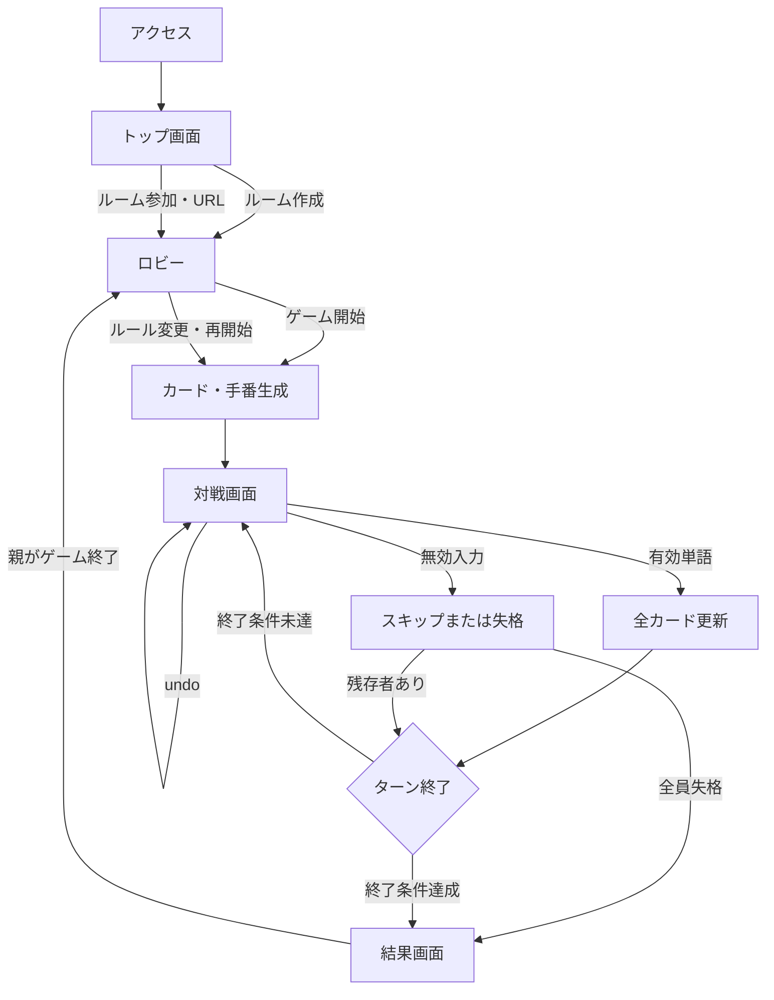

# 10. UIUX・画面遷移

## 10.1 画面遷移

## 10.2 トップ画面

トップ画面は、アクセス時に最初に表示する画面である。

- サービス名と簡潔な説明を表示する。
- 「ルームを作成」ボタン：編集中または選択中の設定および任意のパスワード（合言葉）でルームを作成し、ロビーへ遷移する。
- ルーム作成時パスワード（合言葉）入力欄：パスワードによる保護を希望する場合に入力する（任意）。
- 設定プリセット：名前を付けた設定を保存、選択、読み込み、上書き保存、削除できる。設定の自動保存は行わない。
- 「ルームに参加」ボタン：参加者が選択し、ルームURL・ルームID入力欄を表示する。
- ルームURL・ルームID入力欄：アルファベットと数字からなるルームIDまたはルームURLを入力する。パスワードが設定されている場合はパスワード入力欄も表示する。
- 参加者名入力欄：参加時に表示する名前を入力する。
- 参加ボタン：サーバーに参加リクエストを送信し、成功時にロビーへ遷移する。ゲーム進行中は対戦画面へ、結果状態では結果画面へ遷移する。
- エラー時は「ルームが見つかりません」「パスワードが違います」などのメッセージを表示する。
- 専用URLへ直接アクセスした場合は、参加者名入力の前にルームの存在を確認する。存在しない場合は名前入力欄を表示せず、「ルームが存在しません」とトップページへ戻るボタンを表示する。

### トップ画面の表示文言

- 利用者の操作やゲームルールの理解に必要な案内だけを、短く自然な日本語で表示する。
- 保存先、保存対象外のデータ、内部状態など、利用者の判断に必要でない実装上の説明は表示しない。
- 「明示操作のみ」のような抽象的・技術的な表現や、見出し・ボタンで伝わる内容の重複説明を避ける。
- 仕様上必要なルール説明は削除せず、利用者が判断しやすい具体的な表現に置き換える。

## 10.3 ロビー内のルール設定

親が参加したロビーでは、ロビー案内、カード文字設定、終了条件、時間、無効入力の順にルール設定を配置する。参加人数と参加者名はこの設定欄で入力しない。

次の操作要件を満たす。

- カードサイズは3以上の奇数を入力でき、初期値5として表示する。現在のカード文字候補数から算出した最大サイズも表示する。
- 指定ビンゴ数はカードサイズ`N`に応じて`1〜2N+2`の範囲で入力できる。
- カードサイズが`N`の場合、`N×N`マスと`2N+2`本のビンゴ列になることを設定欄で確認できる。
- 終了条件を変更すると、対応しない目標値入力を無効化する。
- すべての設定に日本語ラベルと説明を付ける。
- エクストラ設定は初期状態で折りたたみ、最小文字数・最大文字数を設定できるようにする。
- 伸ばし棒設定が無効でも、単語入力では伸ばし棒を使用できることを説明する。
- 単語の存在確認をしないことを説明する。
- 対戦画面の入力欄には、エクストラ設定にかかわらず現在の文字数を常時表示する。
- 対戦モードを個人戦またはチーム戦から選択できる。チーム戦ではチーム数を設定し、参加者が所属チームを選択できる。
- チーム戦では未所属者を人数差なくランダム配置するボタンを表示する。
- 時間切れ時の強制スキップを有効にするか選択できる。
- 利用者が選択した設定プリセットを読み込んだ場合、その内容を現在値として表示する。
- ルーム作成後に専用URLが発行され、参加者へ共有できることを表示する。

## 10.3.1 ロビー画面

ロビー画面は専用URL（`/game/:roomId`）で表示し、ルートURLへ戻さずに参加と待機を行う。

- 参加者名入力欄と参加ボタンを表示する。
- 参加者一覧と現在の参加人数を表示する。
- パスワード保護の有無を表示する（パスワードが設定されている場合はパスワード保護バッジを表示）。
- 各参加者は自分の名前を編集して保存できる。空文字で保存しようとした場合はエラーを表示し、現在の名前を維持する。
- ロビーURLとURLコピー操作を表示する。
- 親には参加者が2人以上のときだけ「ゲームを開始」ボタンを有効にする。
- 親以外には開始を待っている状態を表示する。
- 参加者の増減をSSEで同期する。
- 親には接続中の参加者を選択して親を変更する操作を表示する。親変更後は全参加者へ通知する。

## 10.4 対戦画面

次の領域を分けて表示する。レイアウトは画面サイズに応じてレスポンシブに変更する。

1. 上部: ターン、現在プレイヤーまたはチーム、開始文字、残り時間
2. 中央上部: 単語入力欄、確定、undo、操作結果通知（単語入力欄は現在の手番プレイヤーまたは現在チームのメンバーに表示、操作結果通知は全員に表示）
3. 中央下部: プレイヤーまたはチームごとのカードとビンゴ数
4. 端部または下部: 固定手番順と有効単語履歴

### PCレイアウト（画面幅768px以上）

- カードはしりとりの手番順に横並びまたはグリッドで表示する。
- 入力欄とカードを同時に見える配置とする。
- 単語履歴はサイドバーまたは下部に配置する。

### スマートフォンレイアウト（画面幅767px以下）

- カードはしりとりの手番順に縦に積み重ねて表示する。
- 各カードは画面幅いっぱいに表示し、横スクロールは発生させない。
- 入力欄は画面下部に固定し、常に操作しやすい位置に配置する。
- 単語履歴は折りたたみ可能なパネルとして配置する。
- 現在プレイヤーと開始文字は画面上部に常時表示する。

現在の手番ではないプレイヤーは入力欄と確定ボタンを表示しない。チーム戦では現在チームの所属者だけに表示する。undoは親だけが操作できる。

## 10.5 入力中の表示

入力欄の変更イベントごとに、現在の単語文字と一致する未開放マスをプレビュー表示する。プレビューはフロントエンド側で即時に行い、確定操作時に送信可否を検査する。

空文字（0文字）またはひらがなと伸ばし棒以外を含む入力を確定しようとした場合は、プレビューを消し、入力欄の内容を保持したまま送信を阻止して固定エラーを表示する。サーバー判定でゲームルール上の無効入力となった場合は、設定された無効入力処理を適用し、処理後に入力欄を空にする。サーバー判定の入力結果、無効理由、処理結果は全員に表示する。

## 10.6 カードの表示原則

- 開放済み、未開放、プレビュー中、ビンゴ成立列を視覚的に区別する。
- ビンゴまで残り1マスの未開放マスをリーチマスとして表示し、複数列を同時に完成できる場合は追加で強調する。
- ビンゴ成立は色だけでなく、境界線、模様、アイコンなどでも示す。
- フリーマスには「FREE」または同等の日本語ラベルを付け、開始時から開いていることが分かるようにする。
- プレイヤー名とビンゴ数を同じカード見出しに表示する。
- 失格したプレイヤーまたはチームはカードを消さず、失格状態を表示する。

## 10.7 結果発表画面

最上部に終了理由と順位一覧を表示し、その下に個人戦ではプレイヤーごと、チーム戦ではチームごとのカード状況をしりとり順で表示する。カードの下では、文字開放状態表を横幅いっぱいに表示し、その下に単語履歴を横幅いっぱいの2列で表示する。

順位は Standard Competition Ranking（1224方式）で表示し、同順位がある場合は次の順位をスキップする。失格者は順位欄を「失格」とする。

文字開放状態表は、右から順にあ行〜わ行、濁音、半濁音、小さいあ行、特殊文字（ゃゅょっー）の5段縦列グリッド（右から左へ並べる日本語の縦書き順）として表示する。

親には「ゲーム終了」ボタンを表示し、参加者には親の操作を待つ案内を表示する。

### スマートフォンレイアウト

- 順位一覧は画面幅いっぱいに表示する。
- 各プレイヤーまたはチームのカードは縦に積み重ねて表示する。
- 単語履歴と文字開放状態表は、折りたたみ可能なセクションとして表示する。

## 10.8 操作性

- 入力欄へ自動フォーカスする。
- Enterキーで単語を確定できる。
- ボタンはキーボードでフォーカス・操作できる。
- スマートフォンでは、タッチ操作がしやすい大きさ（最小44×44px）のボタンと入力欄を使用する。
- スマートフォンでは、画面下部に入力欄を固定配置し、キーボード表示時も操作しやすい位置に保つ。
- 現在手番、残り時間、エラーは文字でも表示する。
- 色覚差がある場合でも、カード状態とビンゴ状態を判別できるようにする。
- 親が画面を見ながら操作しやすい文字サイズとコントラストを確保する。
- スマートフォンでも参加者がカードの状態を確認しやすいよう、文字サイズとカードの余白を適切に設定する。

## 10.9 タイポグラフィ・フォント

- 全画面の共通フォントファミリーとして `Noto Sans JP`（フォールバック: `sans-serif`）を指定する。
- ひらがな、カタカナ、漢字、数字、記号のすべてのテキスト表示において、端末やOSに依存しない均一で明瞭な視認性・可読性を確保する。
- カードマス内の文字、入力プレビュー、案内テキスト、ビンゴ数表示など、重要度に応じたフォントウェイトと文字サイズを設定する。

